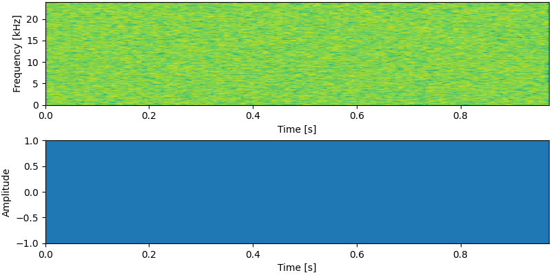
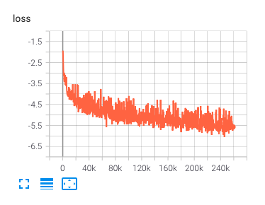
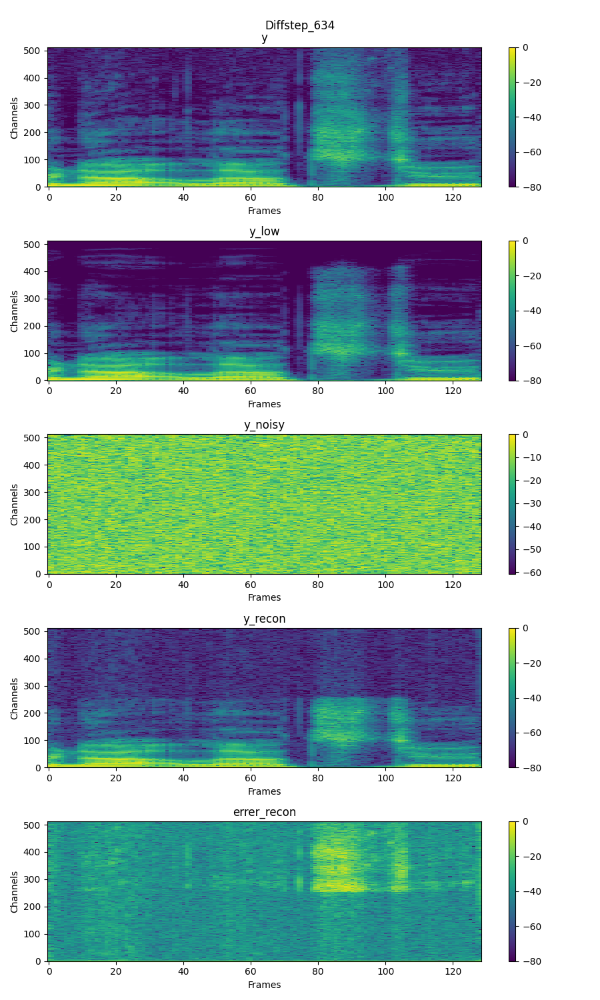

# NU-Wave &mdash; Official PyTorch Implementation

**NU-Wave: A Diffusion Probabilistic Model for Neural Audio Upsampling**<br>
Junhyeok Lee, Seungu Han @ [MINDsLab Inc.](https://github.com/mindslab-ai), SNU

[](https://arxiv.org/abs/2104.02321) [](https://github.com/mindslab-ai/nuwave) [](https://mindslab-ai.github.io/nuwave/)

Official Pytorch+[Lightning](https://github.com/PyTorchLightning/pytorch-lightning) Implementation for NU-Wave.<br>



Update: Bib is updated as [isca_archive](https://www.isca-speech.org/archive/interspeech_2021/lee21c_interspeech.html) <br>


## Requirements
- [Pytorch](https://pytorch.org/) >=1.7.0 for nn.SiLU(swish activation)<br>
- [Pytorch-Lightning](https://github.com/PyTorchLightning/pytorch-lightning)==1.1.6<br>
- The requirements are highlighted in [requirements.txt](./requirements.txt).<br>
- We also provide docker setup [Dockerfile](./Dockerfile).<br>

## Preprocessing
Before running our project, you need to download and preprocess dataset to `.pt` files
1. Download [VCTK dataset](https://datashare.ed.ac.uk/handle/10283/3443)
2. Remove speaker `p280` and `p315`
3. Modify path of downloaded dataset `data:dir` in `hparameter.yaml`
4. run `utils/wav2pt.py`
```shell script
python utils/wav2pt.py
```

## Training
1. Adjust `hparameter.yaml`, especially `train` section.
```yaml
train:
  batch_size: 18 # Dependent on GPU memory size
  lr: 0.00003
  weight_decay: 0.00
  num_workers: 64 # Dependent on CPU cores
  gpus: 2 # number of GPUs
  opt_eps: 1e-9
  beta1: 0.5
  beta2: 0.999
```
- If you want to train with single speaker, use `VCTKSingleSpkDataset` instead of `VCTKMultiSpkDataset` for dataset in `dataloader.py`. And use `batch_size=1` for validation dataloader.
- Adjust `data` section in `hparameters.yaml`.
```yaml
data:
  dir: '/DATA1/VCTK/VCTK-Corpus/wav48/p225' #dir/spk/format
  format: '*mic1.pt'
  cv_ratio: (223./231., 8./231., 0.00) #train/val/test
```
2. run `trainer.py`.
```shell script
$ python trainer.py
```
- If you want to resume training from checkpoint, check parser.
```python
    parser = argparse.ArgumentParser()
    parser.add_argument('-r', '--resume_from', type =int,\
            required = False, help = "Resume Checkpoint epoch number")
    parser.add_argument('-s', '--restart', action = "store_true",\
            required = False, help = "Significant change occured, use this")
    parser.add_argument('-e', '--ema', action = "store_true",\
            required = False, help = "Start from ema checkpoint")
    args = parser.parse_args()
```
- During training, tensorboard logger is logging loss, spectrogram and audio.
```shell script
$ tensorboard --logdir=./tensorboard --bind_all
```



## Evaluation
run `for_test.py` or `test.py`
```shell script
python test.py -r {checkpoint_number} {-e:option, if ema} {--save:option}
or
python for_test.py -r {checkpoint_number} {-e:option, if ema} {--save:option}
```
Please check parser.
```python
    parser = argparse.ArgumentParser()
    parser.add_argument('-r', '--resume_from', type =int,
                required = True, help = "Resume Checkpoint epoch number")
    parser.add_argument('-e', '--ema', action = "store_true",
                required = False, help = "Start from ema checkpoint")
    parser.add_argument('--save', action = "store_true",
               required = False, help = "Save file")
```
While we provide lightning style test code `test.py`, it has device dependency. 
Thus, we recommend to use `for_test.py`.

## References
This implementation uses code from following repositories:
- [J.Ho's official DDPM implementation](https://github.com/hojonathanho/diffusion)
- [lucidrains' DDPM pytorch implementation](https://github.com/lucidrains/denoising-diffusion-pytorch)
- [ivanvovk's WaveGrad pytorch implementation](https://github.com/ivanvovk/WaveGrad)
- [lmnt-com's DiffWave pytorch implementation](https://github.com/lmnt-com/diffwave)

This README and the webpage for the audio samples are inspired by:
- [Tips for Publishing Research Code](https://github.com/paperswithcode/releasing-research-code)
- [Audio samples webpage of DCA](https://google.github.io/tacotron/publications/location_relative_attention/)
- [Cotatron](https://github.com/mindslab-ai/cotatron/)
- [Audio samples wabpage of WaveGrad](https://wavegrad.github.io)

The audio samples on our [webpage](https://mindslab-ai.github.io/nuwave/) are partially derived from:
- [VCTK dataset(0.92)](https://datashare.ed.ac.uk/handle/10283/3443): 46 hours of English speech from 108 speakers.

## Repository Structure
```
.
├── Dockerfile
├── dataloader.py           # Dataloader for train/val(=test)
├── filters.py              # Filter implementation
├── test.py                 # Test with lightning_loop.
├── for_test.py             # Test with for_loop. Recommended due to device dependency of lightning
├── hparameter.yaml         # Config
├── lightning_model.py      # NU-Wave implementation. DDPM is based on ivanvok's WaveGrad implementation
├── model.py                # NU-Wave model based on lmnt-com's DiffWave implementation
├── requirement.txt         # requirement libraries
├── sampling.py             # Sampling a file
├── trainer.py              # Lightning trainer
├── README.md           
├── LICSENSE
├── utils
│  ├── stft.py              # STFT layer
│  ├── tblogger.py          # Tensorboard Logger for lightning
│  └── wav2pt.py            # Preprocessing
└── docs                    # For github.io
   └─ ...
```

## Citation & Contact
If this repository useful for your research, please consider citing!
```bib
@inproceedings{lee21nuwave,
  author={Junhyeok Lee and Seungu Han},
  title={{NU-Wave: A Diffusion Probabilistic Model for Neural Audio Upsampling}},
  year=2021,
  booktitle={Proc. Interspeech 2021},
  pages={1634--1638},
  doi={10.21437/Interspeech.2021-36}
}```
If you have a question or any kind of inquiries, please contact Junhyeok Lee at [jun3518@mindslab.ai](mailto:jun3518@mindslab.ai)
